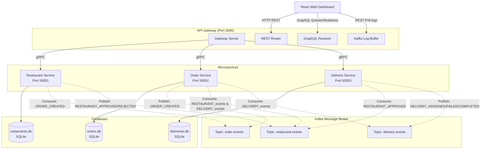

# DelivSaga: Smart Food Delivery Microservices Application

DelivSaga is a modern, event-driven microservices application implementing the **Saga Choreography Pattern** for resilient transaction orchestration. Built with **Node.js** and **TypeScript**, the architecture leverages **gRPC** for high-performance synchronous calls, **Apache Kafka** for asynchronous transaction states, independent **SQLite3** databases for service encapsulation, and a unified **API Gateway** exposing both **REST** and **GraphQL** endpoints. A real-time **React + Vite** dashboard enables visual control, telemetry mapping, and monitoring.

---

## 1. System Architecture

The application decouples the domains of Restaurant Catalog, Ordering, and Delivery Dispatch.



---

## 2. Technology Stack

*   **Runtime & Language**: Node.js v20+, TypeScript (ESNext compiling)
*   **Monorepo Tooling**: NPM Workspaces
*   **Synchronous RPC**: `@grpc/grpc-js` + `@grpc/proto-loader`
*   **Asynchronous Message Broker**: Apache Kafka (`kafkajs`)
*   **Persistence Layer**: SQLite3 (`better-sqlite3`)
*   **Unified API Gateway**: Express.js + Apollo Server v4 (`@apollo/server`)
*   **Client Dashboard**: React 18, Vite, Lucide icons, and Vanilla CSS

---

## 3. Directory Layout

```text
/home/sary/kafka abir/
├── package.json                   # Monorepo workspaces definition
├── docker-compose.yml             # Local Kafka & Zookeeper configuration
├── setup.sh                       # Automation setup script
├── shared/
│   ├── create-topics.mjs          # Kafka admin topic setup utility
│   └── proto/                     # Protocol Buffers definitions
│       ├── restaurant.proto       # Restaurant Catalog service gRPC interface
│       ├── order.proto            # Order Orchestration service gRPC interface
│       └── delivery.proto         # Driver Dispatch service gRPC interface
├── gateway/                       # Express + Apollo GraphQL API Gateway
│   ├── src/
│   │   ├── index.ts               # Core HTTP server and Kafka logs listener
│   │   ├── grpc-clients.ts        # gRPC client initialization
│   │   ├── graphql/               # GraphQL Schema & Resolvers
│   │   └── rest/                  # Express REST routing
├── services/
│   ├── restaurant-service/        # Restaurant and Menu microservice
│   ├── order-service/             # Ordering and Saga coordination microservice
│   └── delivery-service/          # Agent tracking and dispatch microservice
└── frontend/                      # Premium React dashboard client
```

---

## 4. The Event-Driven Saga Pattern

Decentralized transaction state transition table:

| Topic | Event Type | Producer | Consumer | Action / Compensation |
| :--- | :--- | :--- | :--- | :--- |
| `order-events` | `ORDER_CREATED` | Order Service | Restaurant Service | Validates item stock & restaurant availability. |
| `restaurant-events` | `RESTAURANT_APPROVED` | Restaurant Service | Delivery, Order Service | **Order**: Sets order to approved.<br>**Delivery**: Assigns idle driver. |
| `restaurant-events` | `RESTAURANT_REJECTED` | Restaurant Service | Order Service | **Compensation**: Rolls back order status to `CANCELLED_RESTAURANT_REJECTED`. |
| `delivery-events` | `DELIVERY_ASSIGNED` | Delivery Service | Order Service | Links driver, shifts order status to `PREPARING` and then `EN_ROUTE`. |
| `delivery-events` | `DELIVERY_FAILED` | Delivery Service | Order Service | **Compensation**: Cancels order with state `CANCELLED_NO_DRIVERS`. |
| `delivery-events` | `DELIVERY_COMPLETED` | Delivery Service | Order Service | Commits transaction, marks order `DELIVERED`. |

---

## 5. Port Mappings Summary

| Service | Port | Endpoint URL | Protocol |
| :--- | :--- | :--- | :--- |
| **API Gateway** | `3000` | `http://localhost:3000` | REST API & GraphQL Server |
| **React Dashboard** | `5173` | `http://localhost:5173` | Web UI Client |
| **Restaurant Microservice** | `50051` | `localhost:50051` | gRPC |
| **Order Microservice** | `50052` | `localhost:50052` | gRPC |
| **Delivery Microservice** | `50053` | `localhost:50053` | gRPC |
| **Kafka Message Broker** | `9092` | `localhost:9092` | Kafka Protocol |

---

## 6. Quick Start Guide

### Prerequisites
Make sure you have `node` (v20+ recommended), `npm`, and `docker` installed.

### Step 1: Automatic Workspace Setup
Run the unified setup script. This script installs workspace node packages, starts the Kafka container (if Docker is running), creates the topics, seeds SQLite databases, and compiles all packages:
```bash
./setup.sh
```

### Step 2: Start the Ecosystem
Launch Zookeeper, Kafka, the three microservices, the API Gateway, and the React frontend concurrently:
```bash
npm run dev
```

### Step 3: Run the Simulation
1. Open your browser and navigate to **`http://localhost:5173/`**.
2. Select a restaurant (e.g. *The Burger Club*).
3. Add items to your cart and press **Place Order**.
4. Monitor the **Active Orders** list to watch the order progress: `PENDING` $\rightarrow$ `RESTAURANT_APPROVED` $\rightarrow$ `PREPARING` $\rightarrow$ `EN_ROUTE` $\rightarrow$ `DELIVERED`.
5. Switch to **Kafka Events** to inspect the real-time JSON log payloads.
6. Switch to **Driver Simulation** and click **Simulate Travel** to manually update coordinates on the telemetry grid map.
